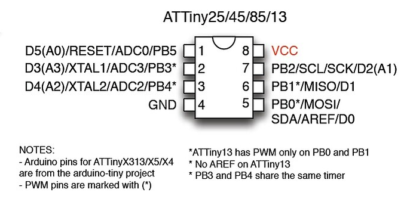

# Attiny85-Codes

- [x] Distance measuring in meters and centimeters using Oled display
- [x] Temperature and humudity (DHT11) with using Oled display
- [x] Alcohol tester with MQ-3 connect MQ-3 pin "A0" to Attiny85 physical pin "2" (it is A3)
- Look at the photo of Attiny85 pins in this reposistory !

